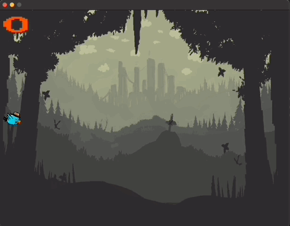

Flappy Gopher
==============

### Requirements ###
- [GO 1.18](https://go.dev/)
- [SDL2](https://libsdl.org/download-2.0.php)

### Installation ###
Clone the repository
```sh
$ git clone git@github.com:albertcolom/flappy-gopher.git
```
Install dependencies
```sh
$ go mod vendor
```
Build & Run
```sh
$ go build && ./flappy-gopher
```

### Tutorial ###
The project is based on the following video tutorial:

- Part 1: https://www.youtube.com/watch?v=aYkxFbd6luY 
- Part 2: https://www.youtube.com/watch?v=tX_Fgt0gVbQ
- Part 3: https://www.youtube.com/watch?v=jy9XKfYjtwE

### GamePlay ###
